<div align="center">

# 桥水全天候策略 · 中国版

[](https://idealauror.github.io/all-weather-portfolio/)
[](LICENSE)
[](https://www.python.org/)
[]()
</div>

基于真实 A 股 / 债 / 商品 ETF 数据的全天候风险平价（Risk Parity）回测工程，覆盖 **2005–2026 年（~21 年完整牛熊周期）**，提供 3 套可落地策略，每套支持 4 档现金管理（100% / 85% / 70% / 动态），共 12 个回测。

---

## 概要

三套策略基于同一资产宇宙，在**简单执行**、**长期回报**、**低回撤**三个方向各有侧重，风格不重叠。

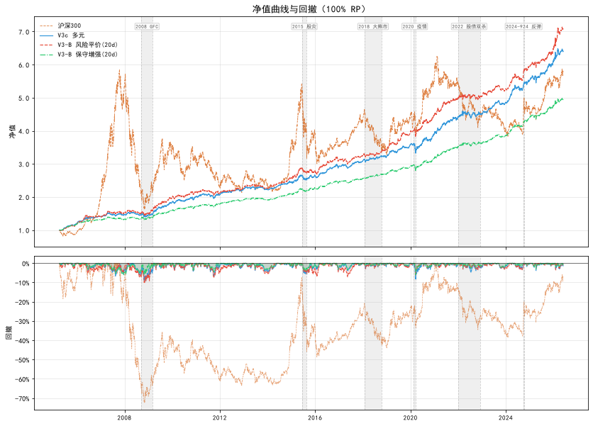

| 策略 | CAGR | 波动率 | 最大回撤 | Sharpe |
|------|:----:|:------:|:--------:|:-----:|
| **V3c 多元** — 简约派 | 7.90% | 4.00% | -7.01% | 1.43 |
| **V3-B 风险平价(20d)** — 学院派 | **10.03%** | 5.64% | -9.48% | 1.39 |
| **V3-B 保守增强(20d)** — 保守增强 | 6.76% | **3.35%** | **-5.35%** | 1.36 |

> 完整指标（含 85% / 70% / 动态三档现金、逐年收益、事件分析、Bootstrap 分位、风控信号频率）见 [完整回测报告](output/report.md)。

---

## 策略速查

| 方案 | 风格 | CAGR | 最大回撤 | Sharpe | 一句话 |
|------|:----:|:----:|:--------:|:-----:|--------|
| **V3c 多元** | 简约派 | 7.90% | -7.01% | 1.43 | 6 资产逆波动率 60d + nonferr 趋势 + HS300 AND 抄底 |
| **V3-B 风险平价(20d)** | 学院派 | **10.03%** | -9.48% | 1.39 | 4 桶等权 RP + nonferr/gold/sp500 趋势 + Gold/HS300 抄底 |
| **V3-B 保守增强(20d)** | 保守增强 | 6.76% | **-5.35%** | 1.36 | 逆波动率 20d + nonferr 趋势 + HS300 AND 抄底 |

> V3-B RP 使用 nonferr(75d) + gold(75d) + sp500(120d) 三重趋势过滤。V3c 和 V3-B Con 使用 nonferr(75d) 趋势过滤 + HS300 AND 抄底。V3-B RP 不含 bond_10y（CAGR +1.43pp, Sharpe -0.02）。

<details>
<summary><b>V3c 多元 (简约派)</b> — CAGR 7.90% | MDD -7.01% | Sharpe 1.43</summary>

6 资产逆波动率加权（60d 回看，max_w=0.30）+ nonferr 趋势过滤（75d SMA）+ Gold 抄底 + HS300 AND 抄底（PB 入场 / PE 出场）。月度调仓，最简执行。

**适合**: 初入全天候、不想研究桶逻辑、追求简单透明。

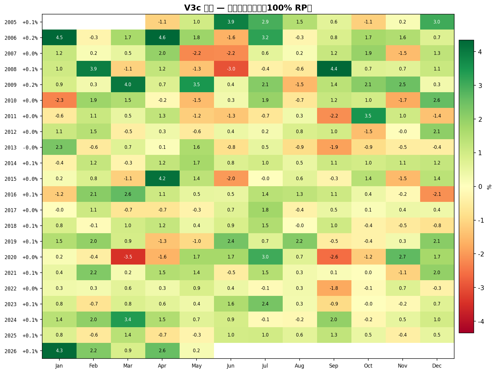
</details>

<details>
<summary><b>V3-B 风险平价(20d) (学院派)</b> — CAGR 10.03% | MDD -9.48% | Sharpe 1.39</summary>

4 桶（增长↑ / 收益垫 / 增长↓ / 通胀↑）等权分层风险平价（HRP, 20d）+ nonferr(75d) + gold(75d) + sp500(120d) 三重趋势过滤 + Gold 抄底 + HS300 AND 抄底。CAGR 最高，但换手率也最高（年化 1.68x）。

**适合**: 长期持有者(5 年+)、认同正统全天候理念、能承受短期波动。

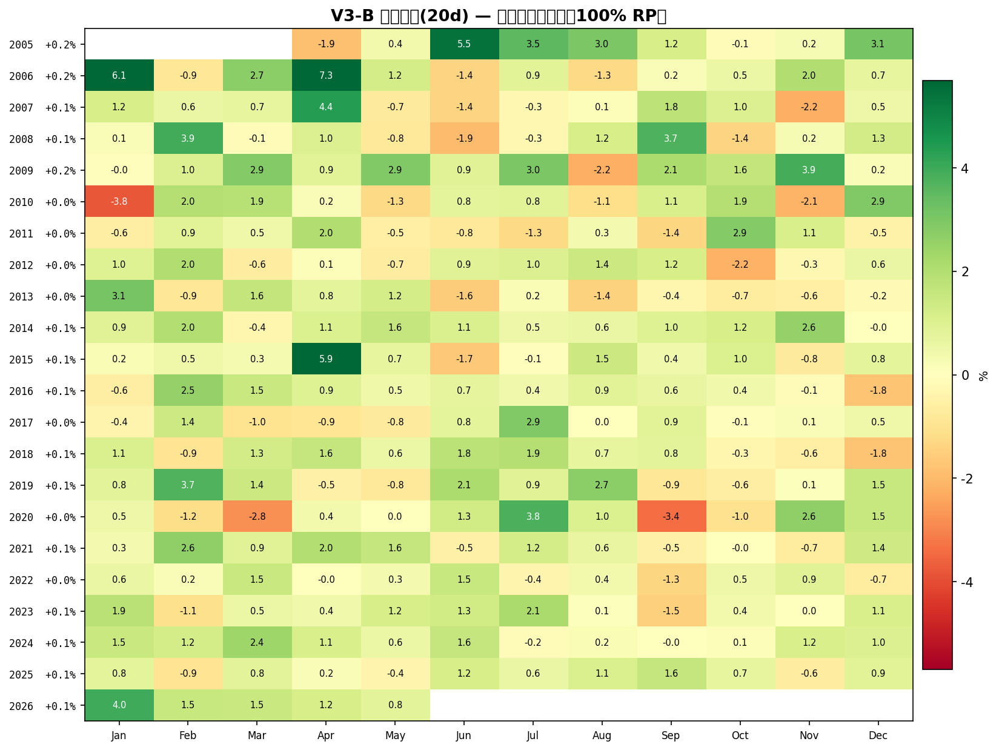
</details>

<details>
<summary><b>V3-B 保守增强(20d) (保守增强)</b> — CAGR 6.76% | MDD -5.35% | Sharpe 1.36</summary>

逆波动率加权（20d 回看，max_w=0.25）+ nonferr 趋势过滤 + HS300 AND 抄底。含 bond_10y（7 资产）。回撤最低(-5.35%)，熊市表现最好，年化成本拖累仅 0.21%。

**适合**: 保守资金、退休金、无法忍受大幅回撤。

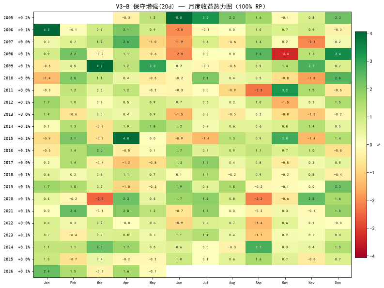
</details>

<details>
<summary><b>多档现金管理</b> — 降低风险暴露，不减 Sharpe</summary>

每策略支持四档: 100% RP（满仓）、85% RP（15% 货币基金）、70% RP（30% 货币基金）、动态（根据 HS300 回撤自动调节）。现金档 Sharpe 基本不衰减，适合不同风险偏好的投资者。

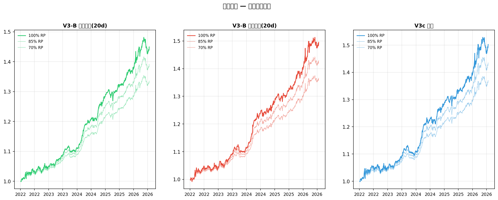
</details>

---

## 核心图表

<details>
<summary><b>年度收益对比</b></summary>
<p>三策略历年收益柱状图。V3-B RP 在牛年弹性最高（2009 +30%，2014 +26%），保守增强在熊年最稳（2013 -1.95%，V3c 同期 -3.63%）。</p>
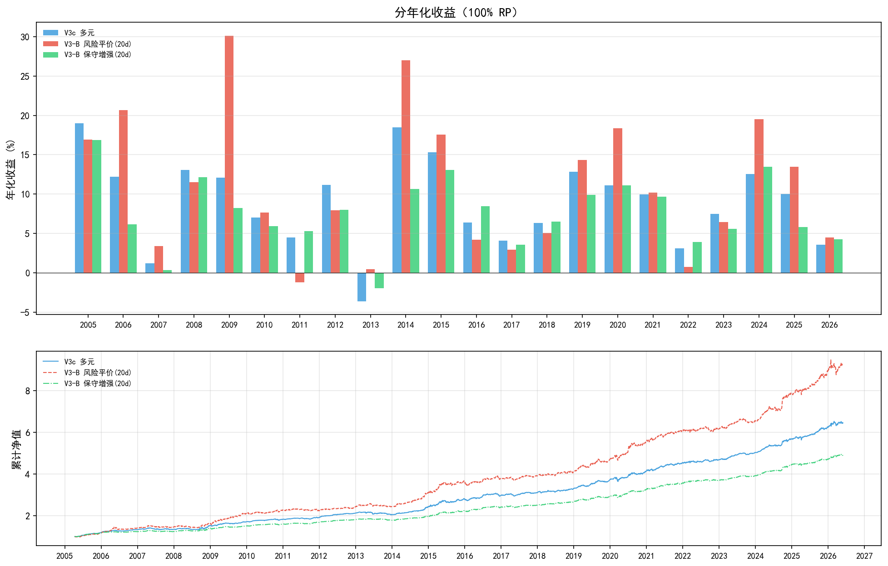
</details>

<details>
<summary><b>滚动 1 年收益</b></summary>
<p>滚动 1 年年化收益曲线。观察策略在不同市场环境下的持续表现。滚动窗口可识别出策略的"不适期"——2013 年三策略均有阶段性承压。</p>
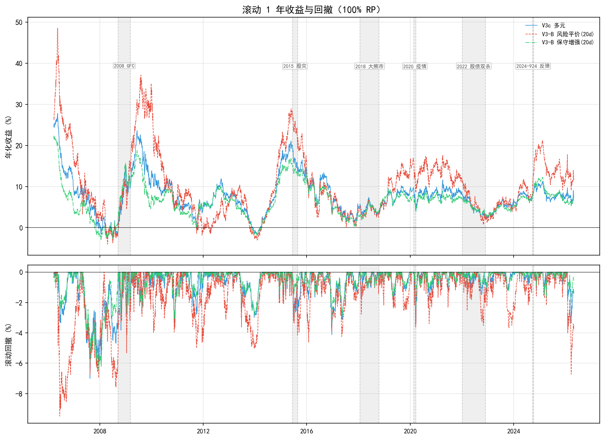
</details>

<details>
<summary><b>月度收益对比</b></summary>
<p>三策略月度收益分布对比（箱形/散点）。V3-B RP 月度波动范围最宽（±5%），保守增强最集中（±2%）。</p>
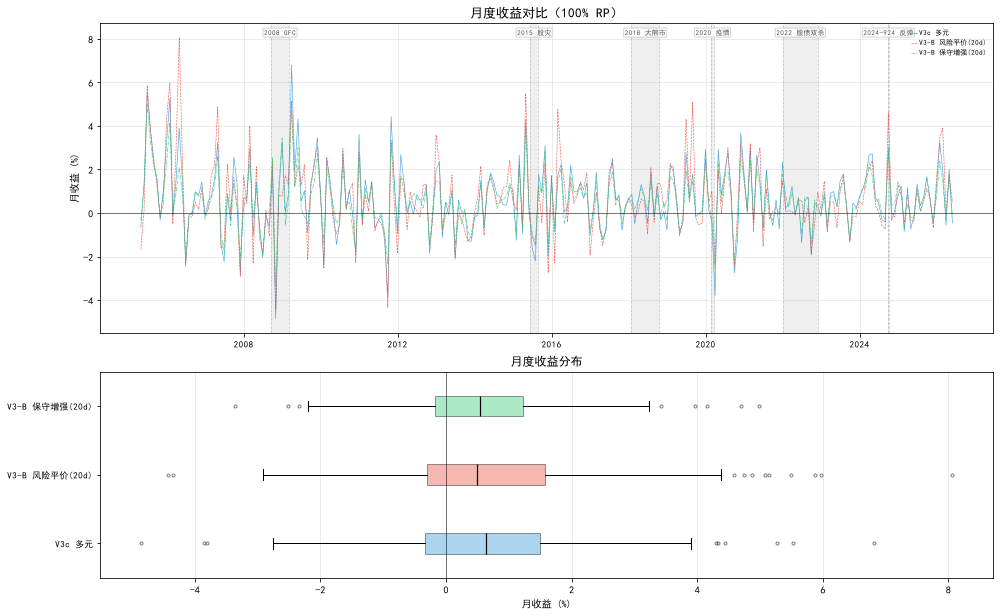
</details>

<details>
<summary><b>宏观四象限表现</b></summary>
<p>全天候策略的核心逻辑——在四个宏观象限（增长↑/↓ × 通胀↑/↓）中都有资产贡献正收益。V3-B RP 在"股牛+债熊"象限表现最强（+8.64%/季），保守增强在"股熊+债牛"防守最稳。</p>

</details>

<details>
<summary><b>关键事件压力测试</b></summary>
<p>14 个历史极端事件（2015 股灾、2016 熔断、2018 大熊市、2022 股债双杀、2024 雪球危机、2025 关税等）。全天候策略在所有事件中均未出现超过 -5% 的跌幅，大部分事件实现正收益。</p>
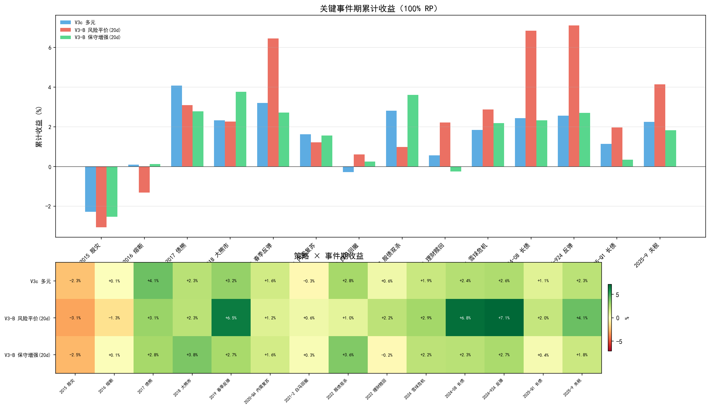
</details>

<details>
<summary><b>Bootstrap 稳健性检验</b></summary>
<p>1000 次 Block Bootstrap（块长 21 天 × 5 年 horizon）模拟的累计收益分布。三策略中位数收益均显著高于沪深 300 基准，亏损概率 < 5%。</p>
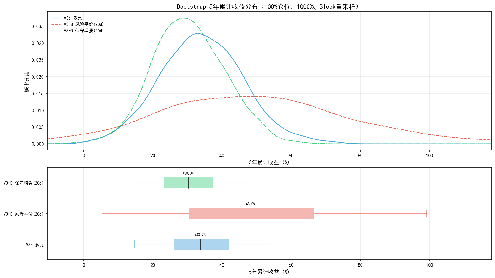
</details>

<details>
<summary><b>权重演化</b></summary>
<p>以 V3c 为例展示权重随市场调整的时序变化。趋势过滤和抄底机制在不同市场阶段自动调节资产暴露。</p>
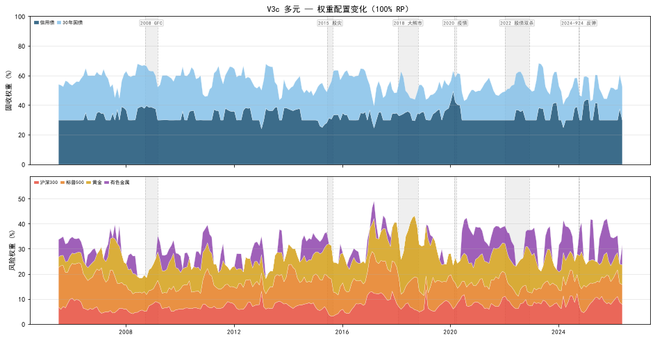
</details>

---

## 资产宇宙

基于桥水原版全天候的**四象限宏观暴露**框架，在 A 股可投范围内选择 ETF：

| 桶 | 资产 | ETF 代码 | V3c | V3-B RP | V3-B Con |
|----|------|:--------:|:---:|:-------:|:--------:|
| **增长↑** | 沪深 300 | 510300 | ✓ | ✓ | ✓ |
| | 标普 500 | 513500 | ✓ | ✓ | ✓ |
| **收益垫** | 城投债 | 511220 | ✓ | ✓ | ✓ |
| **增长↓ 10Y** | 10 年国债 | 511260 | — | — | ✓ |
| **增长↓ 30Y** | 30 年国债 | 511130 | ✓ | ✓ | ✓ |
| **通胀↑** | 黄金 | 518880 | ✓ | ✓ | ✓ |
| | 有色金属 | 159980 | ✓ | ✓ | ✓ |
| **通胀↑ 备选** | ~~原油(QDII)~~ | ~~501018~~ | — | — | — |

> 原油（南方原油 LOF 501018）数据管道已接入，因 QDII 限购+溢价异常，暂不可执行。

<details>
<summary><b>30 年国债 ETF 合成说明</b></summary>
<p>30 年国债 ETF（511130）2024 年 3 月才上市。回测覆盖 2005–2024 年数据缺口采用三阶段合成法：<b>2005–2020</b> 用 10Y 国债指数 × 久期放大系数(×3.0)近似；<b>2020–2024</b> 用利差法（10Y + 期限利差）；<b>2024+</b> 使用真实 ETF 数据。合成段年化扣减 0.3% 作为期权费率差。</p>
</details>

---

## 架构与流水线

```
加载 8 资产面板 → 3 策略 × 4 现金档回测 → 衍生指标 + D_excess → Block Bootstrap → 控制台报告 → 保存输出
```

| 模块 | 职责 |
|------|------|
| `config.py` | 所有常量（回测区间、参数阈值、风险利率） |
| `data.py` | 数据加载 + 30Y 国债三阶段合成 |
| `fetch.py` | 通过 akshare 拉取实时数据 |
| `backtest.py` | V3c 引擎（逆波动率加权） |
| `strategy_b.py` | V3-B 引擎（分层风险平价 + 保守增强） |
| `risk.py` | 逆波动率 / 分层风险平价 / 趋势过滤算法 |
| `stats.py` | 绩效指标 / Block Bootstrap / D_excess 尾部诊断 |
| `reports.py` | 控制台输出格式化 |
| `excel_export.py` | 11-sheet Excel 报告 |
| `markdown_report.py` | Markdown 综合报告 |
| `pipeline.py` | 6 步流水线编排 |

> CI 流水线 (`.github/workflows/backtest.yml`) 每次推送自动运行全量回测，检查 Sharpe / MDD 边界，确保参数改动不引入退化。

---

## 快速开始

```bash
pip install -r requirements.txt
python main.py                        # 全量回测（6 步流水线）
python main.py --fetch                # 拉数据 + 回测
python main.py --no-excel             # 跳过 Excel 报告
python main.py --no-markdown          # 跳过 Markdown 报告

python -m allweather.rebalance        # 实盘再平衡（三策略对比 + 信号仪表盘）
python -m allweather.rebalance --strat V3c   # 只看 V3c 详情
python -m allweather.rebalance --signals     # 只看当前市场信号状态
```

<details>
<summary><b>输出文件说明</b></summary>

| 文件 | 说明 |
|------|------|
| `output/report.xlsx` | 11-sheet Excel 综合报告 |
| `output/report.md` | Markdown 完整报告（指标/逐年/事件/Bootstrap） |
| `output/nv_curves.csv` | 全部回测净值曲线宽表 |
| `output/weight_history_*.csv` | 三策略权重历史 |
| `output/signal_log.csv` | 风控信号触发日志 |
| `docs/charts/*.png` | 15 张分析图表 |
| `docs/data.json` | 结构化指标（前端展示用） |
</details>

---

## 深入阅读

| 资源 | 说明 |
|------|------|
| [完整回测报告](output/report.md) | 自动生成，含全部 12 回测指标、逐年收益、14 事件分析、Bootstrap 分位、风控信号频率 |
| [策略设计论文](docs/strategy-paper.md) | 每个决策的因果逻辑——资产选择、桶结构、趋势过滤、抄底机制、参数选择，以及被否决的替代方案 |
| [在线文档 (GitHub Pages)](https://idealauror.github.io/all-weather-portfolio/) | 含交互式表格和完整图表的 HTML 版本 |

---

## 许可

[AGPL-3.0](LICENSE)
